# Happy Workdog

Happy Workdog 是一个 macOS 桌面陪伴小狗。它常驻桌面和菜单栏，提供提醒、番茄钟、剪贴板历史、区域截图、常用入口和快捷键，适合工作时放在屏幕边上，轻量地帮你维持节奏。

当前版本：`0.1.1`

支持平台：macOS 13+

作者：罗码视界

## 截图

| 桌面小狗 | 设置总览 |
|---|---|
| 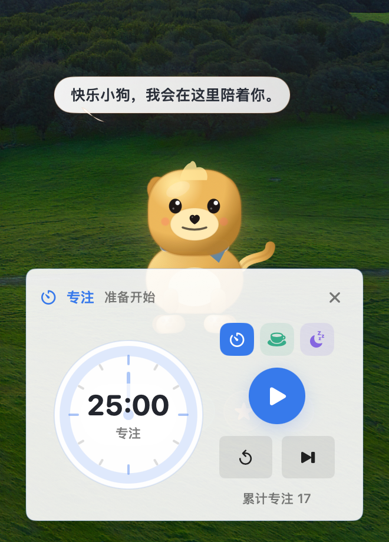 | 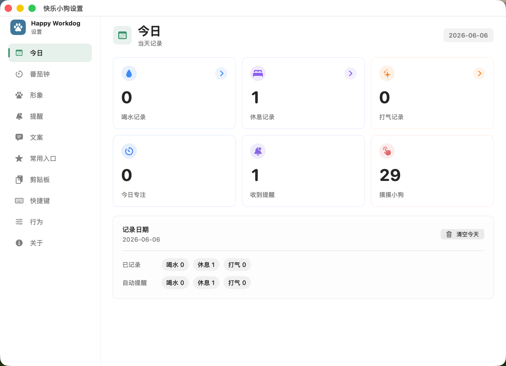 |

| 番茄钟 | 剪贴板历史 |
|---|---|
| 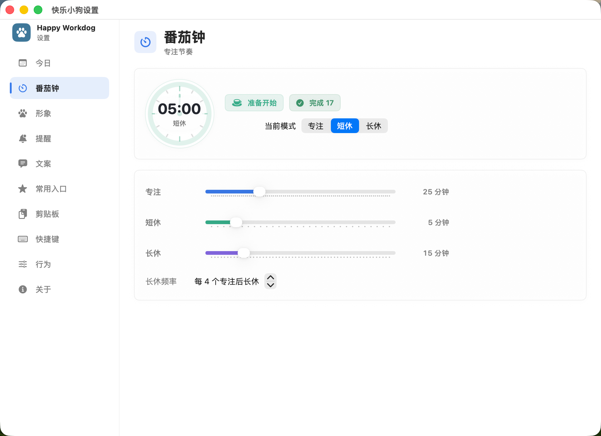 | 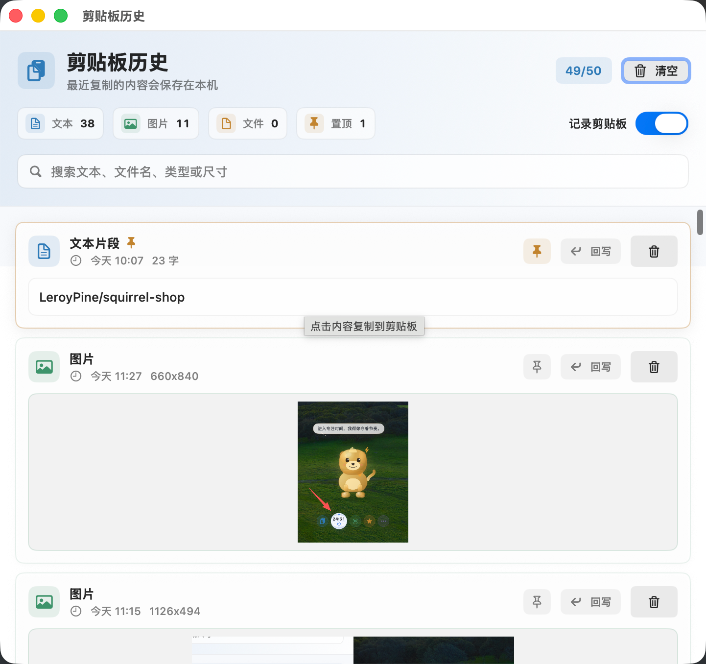 |

| 常用入口 | 形象设置 |
|---|---|
| 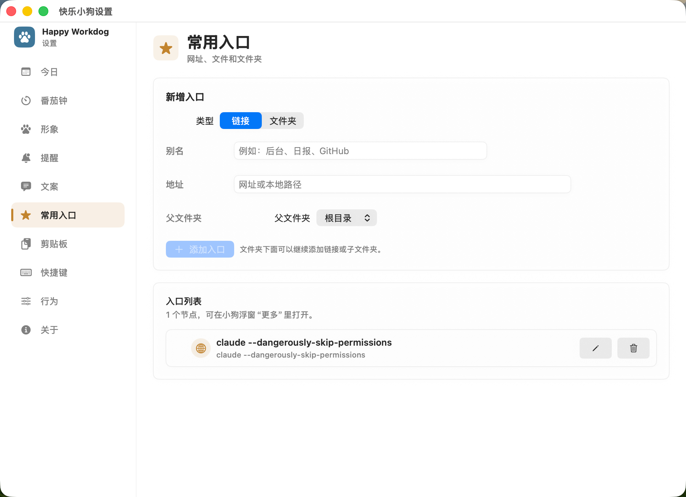 | 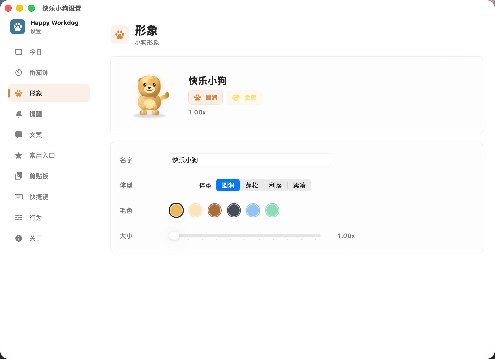 |

| 提醒设置 | 快捷键 |
|---|---|
| 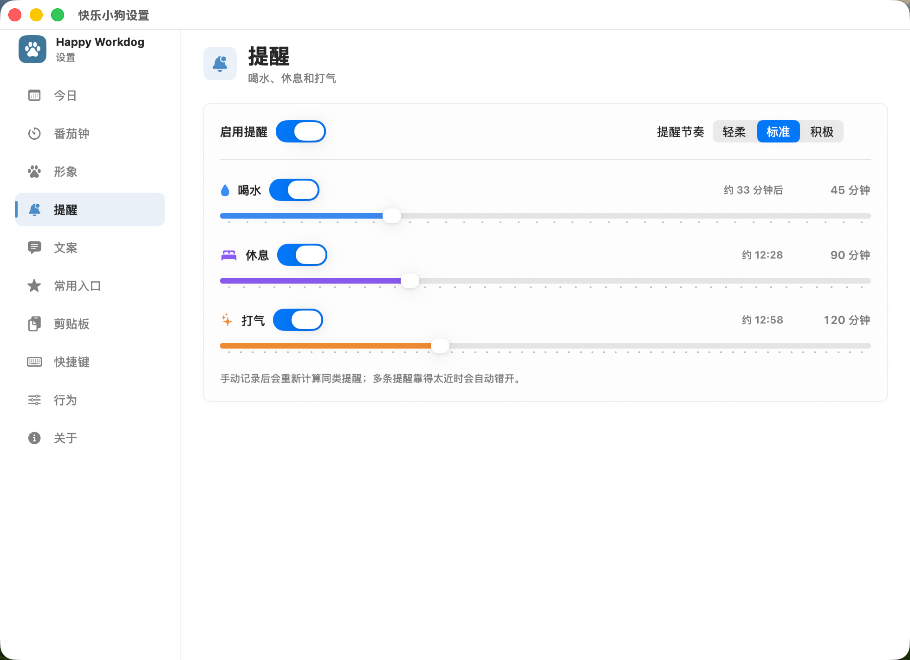 | 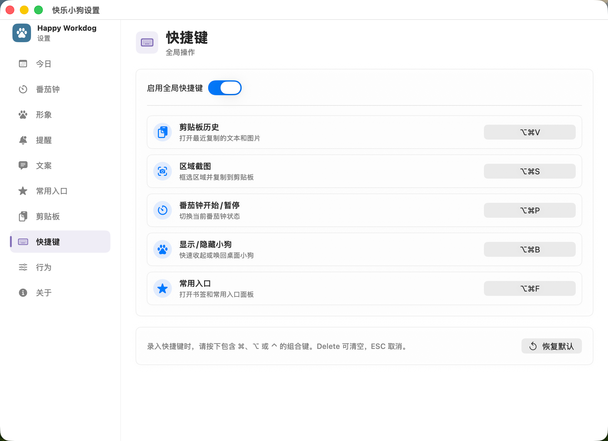 |

| 气泡文案 | 浮窗常驻按钮 |
|---|---|
| 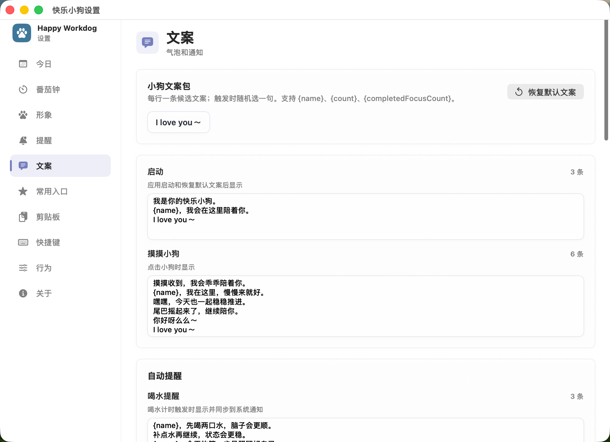 | 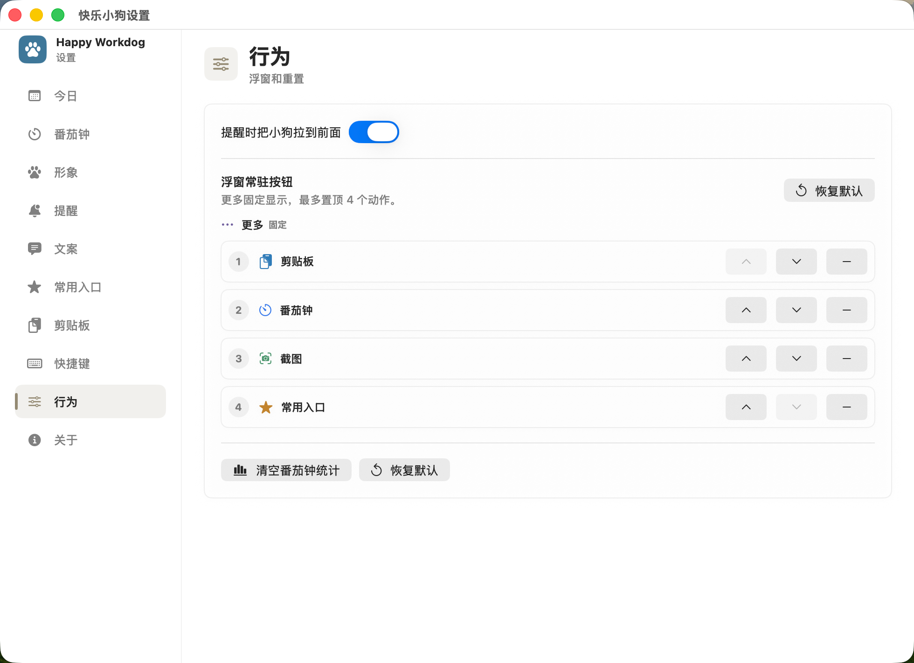 |

| 番茄钟运行中 | 桌面番茄钟 |
|---|---|
| 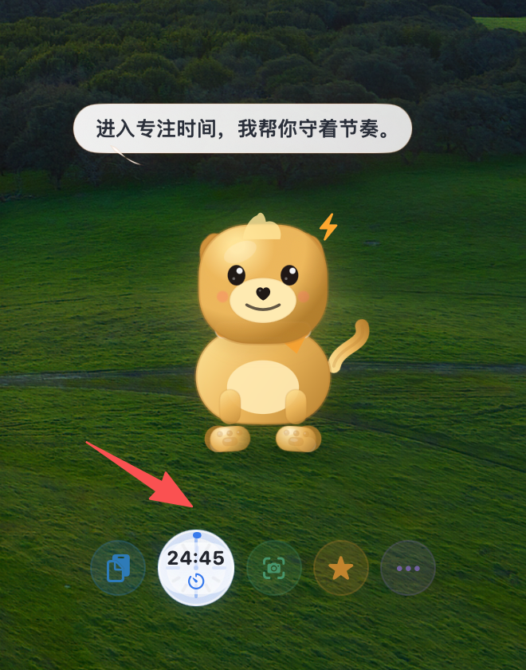 |  |

## 功能

### 桌面小狗

- 透明无边框桌面小狗窗口，可显示在所有桌面空间。
- 菜单栏爪印常驻入口，支持显示或隐藏小狗。
- 小狗可拖动，位置会保存到本地偏好。
- 点击小狗主体可以摸摸，并显示气泡反馈。
- 支持呼吸、眨眼、摇尾巴等轻动画。
- 支持自定义名字、体型、毛色和显示大小。
- 浮窗底部支持最多 4 个常驻按钮，其余动作放在“更多”里。

### 提醒和今日记录

- 支持喝水、休息、打气三类提醒。
- 每类提醒可单独开启或关闭，并可设置提醒间隔。
- 提供轻柔、标准、积极三种提醒节奏，也支持自定义间隔。
- macOS 系统通知提醒，通知里带应用图标。
- 自动提醒会更新小狗状态、气泡文案和今日提醒统计。
- 手动记录喝水、休息、打气会累计今日行为，并重新计算同类提醒。
- 多类提醒过近时会自动错开，减少连续打扰。
- 设置页提供今日摘要，可查看今日专注、提醒次数、摸摸次数和行为明细。
- 每天按本地日期自动切换，也可手动清空今天记录。

### 番茄钟

- 支持专注、短休、长休三种模式。
- 默认时长为 25 / 5 / 15 分钟，可在设置中调整。
- 支持开始、暂停、重置和跳到下一段。
- 支持每若干个专注后进入长休，默认每 4 个专注进入一次长休。
- 专注完成后会发送通知、写入日志、更新小狗状态，并累计今日专注。
- 小狗浮窗提供紧凑番茄钟入口和圆形时钟面板。
- 设置页展示“累计专注”，只统计专注完成次数，不包含短休和长休。

### 剪贴板历史

- 默认自动记录最近 20 条剪贴板内容。
- 支持文本、图片和文件历史。
- 最多保存数量可设置为 10 / 20 / 50 / 100 / 200 条。
- 支持分别开启或关闭文本、图片、文件记录。
- 支持过滤疑似密码、Token、Secret 的敏感文本。
- 重复复制同一内容会自动去重。
- 可在历史窗口搜索文本、文件名、类型或图片尺寸。
- 点选历史项可重新写回系统剪贴板。
- 支持置顶、取消置顶、单条删除和清空历史。
- 图片缓存保存在本机，文件历史只保存路径。
- 剪贴板历史窗口支持手动拉大。

### 区域截图

- 可从小狗底部按钮、菜单栏或全局快捷键触发。
- 截图前会临时隐藏小狗，避免小狗被截进去。
- 自定义冻结屏幕选区，可拖选、移动选区，并通过控制点微调范围。
- 支持箭头、矩形、画笔、文字标注。
- 支持 `Command + Z` 撤销最近一次标注。
- 回车确认后把截图复制到剪贴板，ESC 取消。
- 需要 macOS 屏幕录制权限。

### 常用入口

- 设置里可添加常用链接、文件或文件夹。
- 支持父文件夹和子文件夹树形结构。
- 支持编辑、删除入口。
- 菜单栏“常用入口”和小狗浮窗面板都可打开入口。
- 链接可自动补 `https://`，也支持本地路径。

### 全局快捷键

- 支持启用或关闭全局快捷键。
- 支持自定义每个动作的快捷键。
- 当前动作包括剪贴板历史、区域截图、番茄钟开始/暂停、显示/隐藏小狗、常用入口。
- 设置页会提示注册失败的快捷键。

### 文案和偏好

- 支持自定义小狗启动、摸摸、自动提醒、手动记录、番茄钟完成文案。
- 文案支持 `{name}`、`{count}`、`{completedFocusCount}` 占位符。
- 可一键恢复默认文案。
- 支持配置提醒时是否把小狗拉到前面。
- 支持配置小狗浮窗常驻按钮，最多固定 4 个动作。
- 所有偏好和历史数据本地保存，不上传。

## 下载和安装

第一版推荐通过 GitHub Releases 下载 zip 包：

```text
Happy-Workdog-v0.1.1-macOS.zip
```

下载后解压得到 `Happy Workdog.app`，可以直接打开，也可以拖到 `/Applications`。

注意：当前版本不是 Apple Developer ID 签名，也没有 notarization。首次打开时，macOS 可能提示“无法验证开发者”。可以右键点击 App，选择“打开”，再确认一次。

如果下载后无法直接打开，也可以进入“系统设置 > 隐私与安全性”，在“安全性”区域允许该 App 打开。

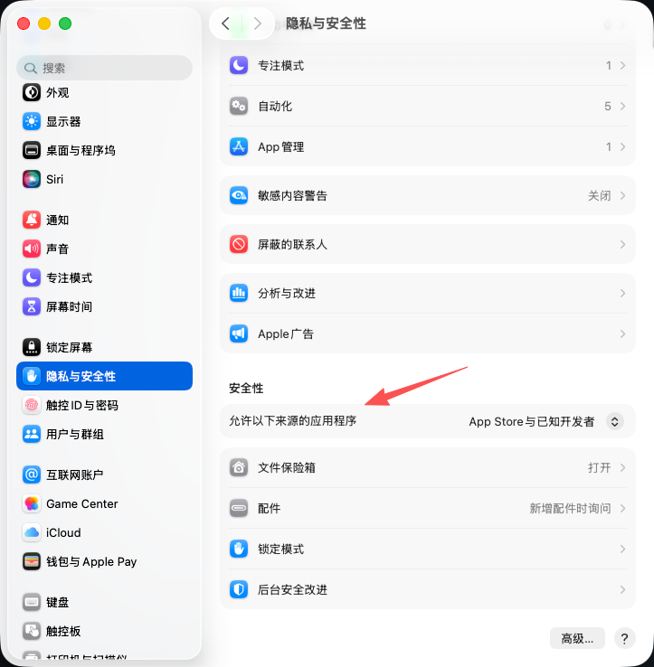

## 开发运行

```bash
swift run --disable-sandbox
```

## 测试

```bash
./scripts/test.sh
```

## 构建 `.app`

```bash
./scripts/package_app.sh
open "build/Happy Workdog.app"
```

构建 release zip：

```bash
mkdir -p dist
ditto -c -k --sequesterRsrc --keepParent \
  "build/Happy Workdog.app" \
  "dist/Happy-Workdog-v0.1.1-macOS.zip"
```

当前应用基于 SwiftUI + AppKit，不需要 Electron 或 Node 依赖。

## 隐私说明

- Happy Workdog 不上传用户数据。
- 剪贴板历史、常用入口、提醒偏好、今日记录等数据保存在本机。
- 剪贴板敏感过滤是启发式策略，不能保证识别所有密码或 Token。
- 文件剪贴板历史只保存本地路径，不复制文件内容。
- 区域截图需要 macOS 屏幕录制权限，截图结果默认写入系统剪贴板。

## 当前状态

这个项目已经具备第一版可用能力，适合通过 GitHub Releases 提供 macOS zip 包下载。后续可以继续补：

- Developer ID 签名和 notarization。
- 更正式的 dmg 安装包。
- 剪贴板常用片段收藏。
- 更细的截图标注样式配置。
- 最近 7 天行为摘要。
